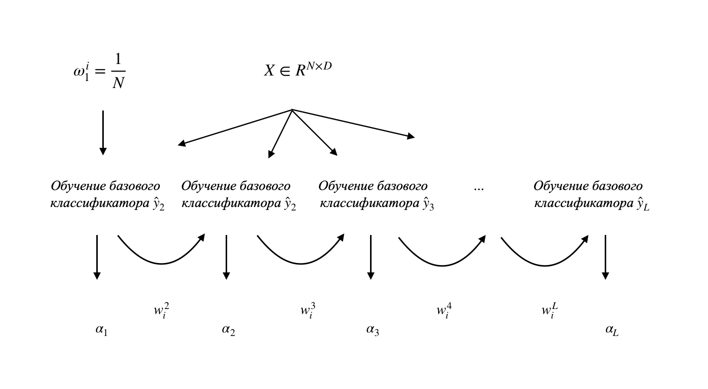

## AdaBoost для задач многоклассовой классификации

Обобщение алгоритма AdaBoost на многоклассовый случай было предложено в [SII-2-3-A8-Zhu](http://ww.web.stanford.edu/~hastie/Papers/SII-2-3-A8-Zhu.pdf). В данной работе авторы предлагают два алгоритма SAMME и SAMME.R, которые представляют собой многоклассовую модификацию AdaBoost для дискретного (когда базовые алгоритмы возвращают только метки классов) и непрерывного (алгоритмы вычисляют вероятности) случаев.

### Алгоритм SAMME (Stagewise Additive Modeling)

#### Дано:
  1. Выборка 
  1. Количество базовых моделей 

#### Найти:
> 

#### Алгоритм
1. Проинициализируем веса для каждого объекта 
1. Для всех 
1. Обучим базовый алгоритм  при помощи весов 
1. Вычислим взвешенную ошибку  алгоритма  :
>                         

   5. Вычислим вес нового классификатора: 

> 

6. Пересчитаем и нормализуем веса: 
> 

7. Конец итерации
8. Финальный прогоном классификатора: 
> 

SAMME является прямым обобщением AdaBoost, так как при K = 2, SAMME становится эквивалентен двухклассовому AdaBoost.

Схематично SAMME изображен на Рис. 1

***

Кулакова Виолетта, 895a
